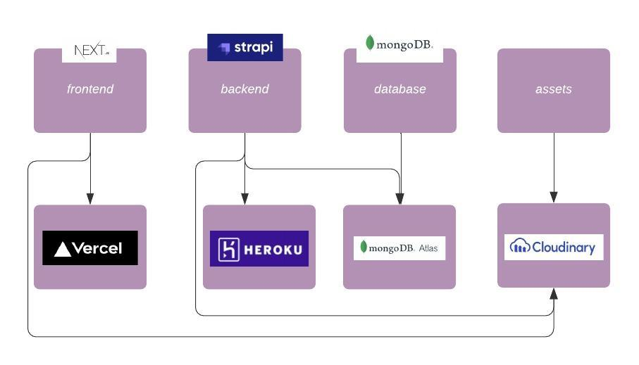

  <h3 align="center">Cars Review</h3>
  
  

    <a href="https://github.com/samuelsilvadev/cars-reviews/tree/master/frontend#table-of-contents">Frontend docs</a>
    ·
    <a href="https://github.com/samuelsilvadev/cars-reviews/tree/master/backend#table-of-contents">Backend docs</a>
  

 

With the growing of the development I sought for tools I could use freely to deploy every part of the application. Since it doesn't demand a high infrastructure because it's a project just to learn and explore new tech, I could use anything and looking to the needs for this project that were a node environment for frontend, and also one for backend, a database repository and a image bucket to save the uploads made on strapi I choose the following services:

## Contributing

Contributions are what make the open source community such an amazing place to
be learn, inspire, and create. Any contributions you make are **greatly
appreciated**.

1. Fork the Project
2. Create your Feature Branch (`git switch -c feature/something-amazing`)
3. Commit your Changes (`git commit -m 'feat(frontend): Add something amazing'`)
4. Push to the Branch (`git push origin feature/something-amazing`)
5. Open a Pull Request

## License

Distributed under the MIT License. See `LICENSE` for more information.

## Contact

Samuel Silva - [@samuelsilvadev](https://twitter.com/samuelsilvadev) -
samuelsilvawb@gmail.com

## Acknowledgements

- [Best README Template](https://github.com/othneildrew/Best-README-Template)
- [Vercel](https://vercel.com/)